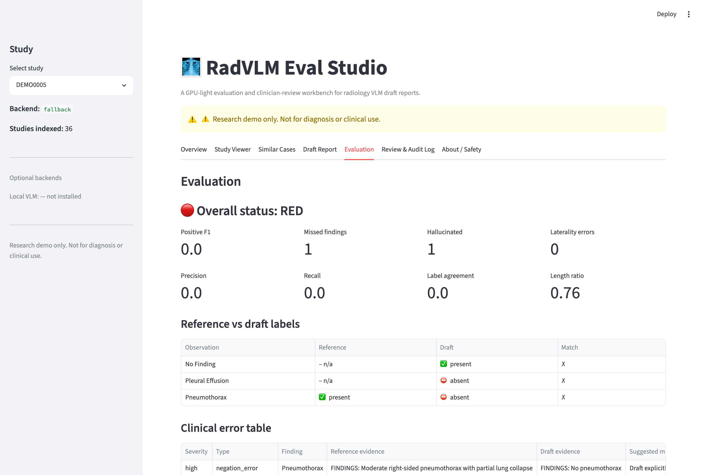
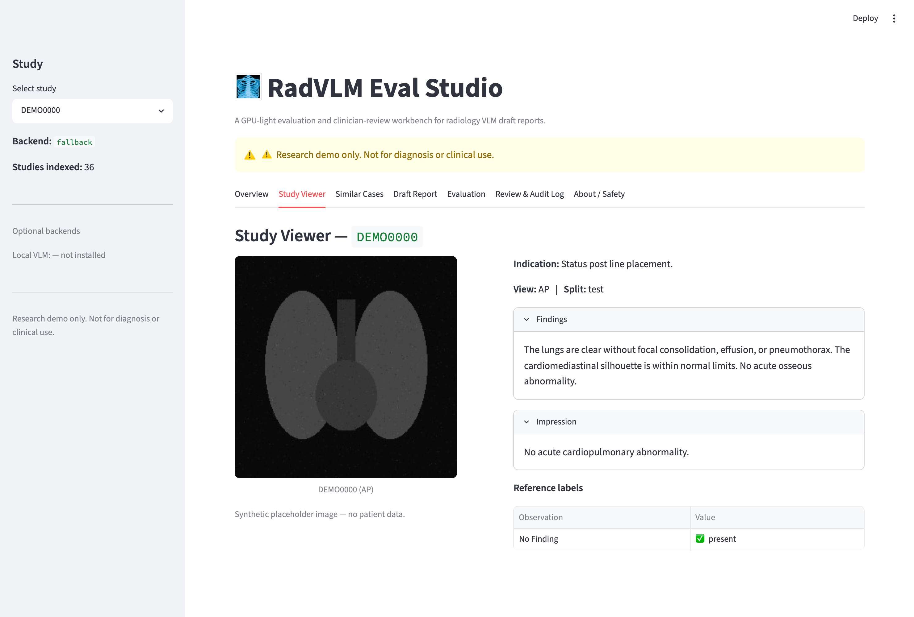
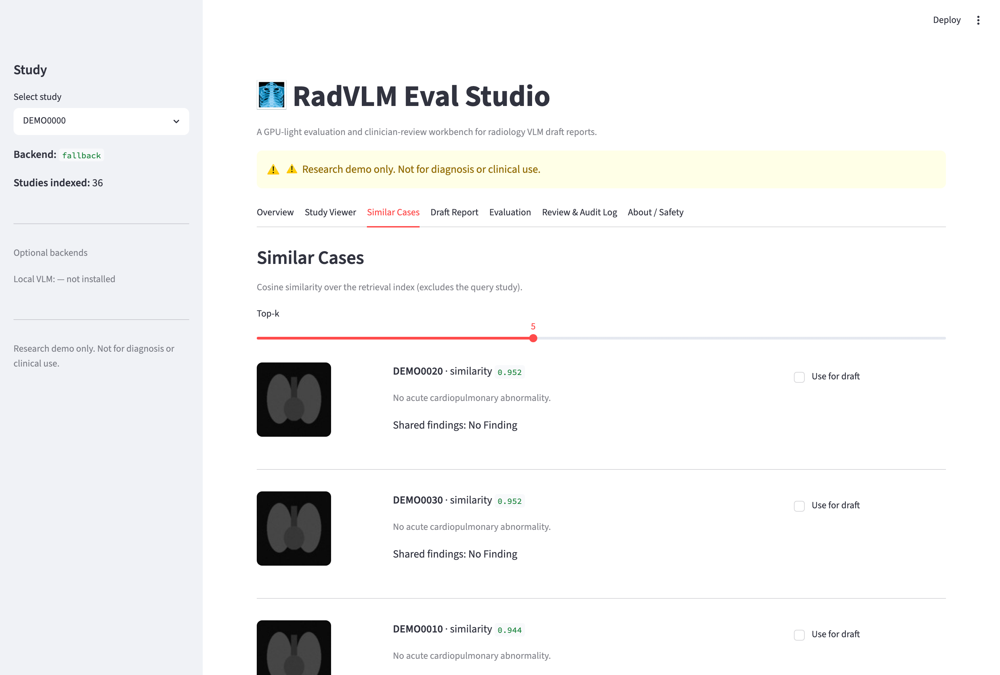
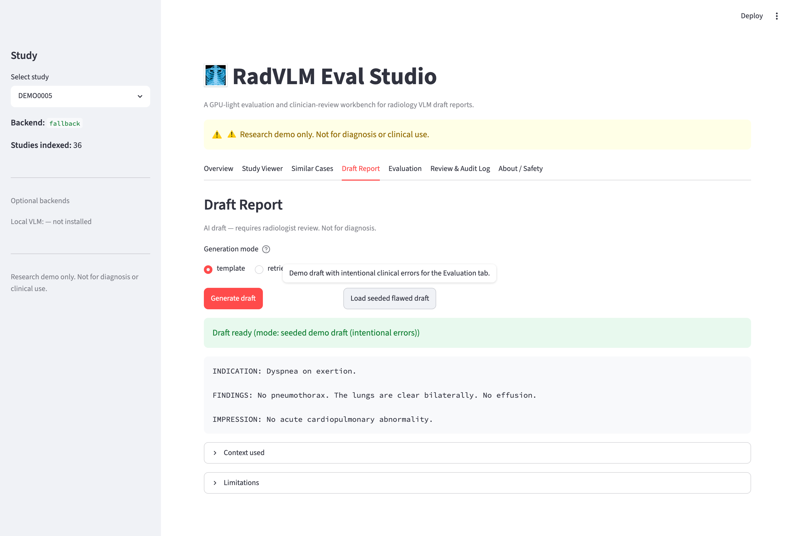
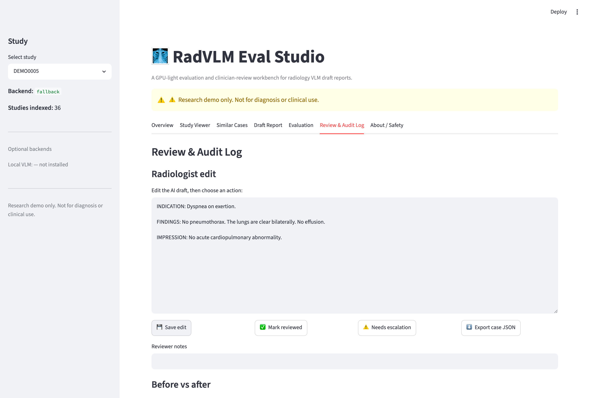
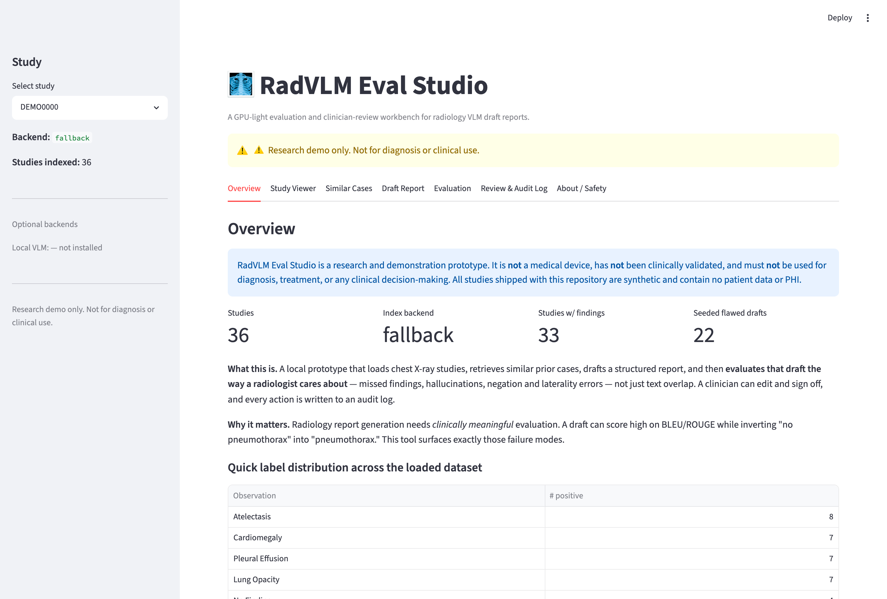

# 🩻 RadVLM Eval Studio

[](https://github.com/nevasini1/radvlm-eval-studio/actions/workflows/ci.yml)
[](https://www.python.org/)
[](LICENSE)
[](#safety)

**A GPU-light evaluation and clinician-review workbench for radiology VLM draft reports.**

> ⚠️ **Research demo only. Not for diagnosis or clinical use.** This is not a medical
> device, has not been clinically validated, and ships with **synthetic data only** —
> no patient data, no PHI, no model weights. The value here is the **evaluation and
> workflow architecture**, not clinical model performance.

---

## Demo video

> _A 3–5 minute walkthrough: seeded flawed draft → RED evaluation → radiologist edit →
> errors fixed → audit log._

📹 **[Watch the walkthrough](docs/demo_script.md)** — _video link coming soon; the
[demo script](docs/demo_script.md) is the exact 4-minute walkthrough, and the
[screenshots below](#screenshots) capture each step._

## Example failure surfaced by the evaluator

This is the kind of error the workbench is built to catch — and that lexical metrics miss:

```text
Reference report : "Moderate right pneumothorax."
AI draft         : "No pneumothorax identified."
Detected error   : negation_error
Severity         : high
Why it matters   : one word flips the clinical meaning (present → absent).
Mitigation       : require radiologist correction before sign-off.
```

The Evaluation tab flags this **RED**, shows both evidence sentences side by side, and the
[Review workflow](#what-it-does) confirms the radiologist edit removes the error
(2 errors → 0). See the [Evaluation screenshot](#screenshots).

## Why this matters

Radiology report generation models are improving fast, but **good text is not the same
as a clinically correct report**. A generated draft can score highly on BLEU/ROUGE while
flipping *"no pneumothorax"* into *"pneumothorax,"* missing a small pleural effusion, or
getting the **laterality** (left vs right) wrong. Those are the errors that actually harm
patients — and lexical metrics are blind to them.

RadVLM Eval Studio is built around the part that real deployment depends on: **clinically
meaningful evaluation, a clinician-in-the-loop review workflow, and failure-mode analysis** —
not large-model training. It runs end-to-end on a laptop.

## What it does

1. **Study Viewer** — load a chest X-ray study (image, indication, findings, impression, labels).
2. **Similar Case Retrieval** — find the most similar prior cases via cosine similarity.
3. **Draft Report Generation** — produce a structured, conservative, RSNA-style draft
   (template / retrieval modes, plus an **optional local-VLM adapter** that falls back
   gracefully when not installed) with mandatory uncertainty + disclaimers.
4. **Clinical Evaluation** — compare the draft against the reference and surface a
   **clinical error taxonomy**: missed findings, hallucinations, negation errors,
   laterality/uncertainty/severity mismatches — with green/yellow/red status.
5. **Radiologist Review** — edit the draft, sign off or escalate, and see **before/after**
   metrics (errors fixed vs introduced).
6. **Audit Log** — every action is persisted to SQLite with timestamps and metrics.

## Features

- ✅ Runs **immediately** on synthetic demo data — no datasets, no API keys, no CUDA.
- ✅ **Clinical error taxonomy**, not just BLEU/ROUGE.
- ✅ Lightweight **retrieval** (image histogram + TF-IDF) working by default, with an
  **optional BiomedCLIP adapter**.
- ✅ Two working **draft-generation** modes (template, retrieval) + an **optional on-device
  MLX-VLM adapter** (integration point with graceful fallback).
- ✅ Transparent **rule-based weak labeler** for the 14 CXR observations (with an optional
  CheXbert hook — not bundled).
- ✅ **Clinician edit + sign-off** workflow with before/after diff.
- ✅ **SQLite audit log** + exportable case-review JSON.
- ✅ **Responsible dataset handling** — importers for IU X-Ray, MIMIC-CXR, CheXpert that
  read *your local copy* and never download or redistribute credentialed data.
- ✅ Graceful degradation: every optional dependency stays optional.

> **Honest scope:** the *working* path is rule-based weak labeling + a label-level clinical
> error taxonomy + lightweight retrieval, all running on synthetic data with no GPU.
> BiomedCLIP, MLX-VLM, RadGraph/RadCliQ, and CheXbert are **optional adapters / integration
> points** — present as clean seams with graceful fallback, **not** fully wired in this build.

## Screenshots

> Captured from the live app running on synthetic demo data.

**Evaluation dashboard** — the star of the project. A seeded draft that says *"no
pneumothorax"* on a study with a confirmed pneumothorax is flagged **RED** as a
high-severity `negation_error`, with the reference and draft evidence sentences side by side.



| Study Viewer | Similar Cases |
|---|---|
|  |  |

| Draft Report | Review & Audit Log |
|---|---|
|  |  |

<details>
<summary>Overview tab</summary>



</details>

## Quickstart

```bash
python -m venv .venv
source .venv/bin/activate
pip install -r requirements.txt

python scripts/make_demo_data.py
python scripts/build_index.py --dataset demo --embedding-backend fallback
streamlit run app/streamlit_app.py
```

Or just run `bash scripts/run_app.sh`.

The app auto-generates demo data + index on first launch if they are missing, so
`streamlit run app/streamlit_app.py` works on a fresh checkout too.

## Hardware

Tested target: **Apple Silicon MacBook, 16 GB unified memory, no CUDA GPU.** The default
retrieval backend uses a normalized image histogram + TF-IDF text vector, so nothing large
is downloaded. BiomedCLIP and a local MLX VLM are **optional**, **off by default**, and
the app degrades gracefully when they are absent.

## Dataset policy

This repository ships **only synthetic demo data**. Real datasets must be obtained by the
user under their own licenses / Data Use Agreements:

| Dataset | Access | Importer |
|---|---|---|
| IU X-Ray / Open-i | Open collection ([openi.nlm.nih.gov](https://openi.nlm.nih.gov/)) | `import_openi` |
| MIMIC-CXR / MIMIC-CXR-JPG | **Credentialed PhysioNet DUA** — never auto-downloaded or redistributed | `import_mimic` |
| CheXpert | Stanford license | `import_chexpert` |

Importers validate the local folder layout and print clear instructions if files are
missing. MIMIC/PhysioNet data **cannot be redistributed** and is never committed.

## Next validation step

The repo intentionally ships **only synthetic data**, so every metric you see in the demo
is illustrative, not a clinical result. The natural next step — and the honest gap between
*demo* and *research validation* — is to run the **same evaluation workflow** on a small,
locally downloaded **IU X-Ray** subset (open) or a **credentialed MIMIC-CXR-JPG** subset,
then report failure-mode counts (missed / hallucinated / negation / laterality) across
**100–500 studies** and compare against optional entity-level metrics (RadGraph F1 /
RadCliQ). No real images or reports would ever be committed — the importers read your local
copy and the `.gitignore` blocks all data artifacts.

## Evaluation methodology

Instead of relying on lexical overlap, the evaluator scores what clinicians care about:

- **Exact label agreement** across the 14 CheXpert observations.
- **Positive-finding precision / recall / F1.**
- **Missed-finding** and **hallucinated-finding** counts.
- **Negation errors** (present↔absent contradictions).
- **Laterality mismatches** (left vs right) — clinically critical.
- **Uncertainty mismatches** (definite vs "possible/cannot exclude").
- **Severity mismatches** and **support-device** disagreements.
- Report length ratio + lexical overlap (for context, never as the primary signal).
- **Optional** entity-level metrics: RadGraph F1 / RadCliQ via `radgraph_adapter`
  (degrades to "optional dependency not installed" — never blocks the demo).

Labels are produced by a transparent **rule-based weak labeler** with clause-scoped
negation/uncertainty detection. It is intentionally auditable and documented as *not* a
substitute for a trained labeler such as **CheXbert** (optional hook provided).

## Small-model training experiment: RadDPO-Lite

Beyond evaluation, the repo includes an optional **text-side** training experiment:
**RadDPO-Lite — evaluator-generated clinical preference tuning for radiology draft repair.**

- Trains a **tiny local LoRA adapter** to *repair* flawed draft reports using the clinical
  errors the evaluator detects (missed / hallucinated findings, negation flips, laterality
  and uncertainty mismatches).
- Runs on **Apple Silicon with 16 GB unified memory** — LoRA/QLoRA over a 4-bit ~1 GB MLX
  model (`mlx-community/Qwen3-1.7B-4bit`); **no CUDA**.
- Uses **synthetic data only**; the evaluator generates the chosen/rejected pairs.
- **Inspired by** preference optimization for reducing hallucinated radiology report content
  (DPO; RRG-DPO) — but it **does not diagnose images** or claim clinical performance.

**📉 Actually trained on a 16 GB Mac (no CUDA).** Training run summary:

| Setting / metric | Value |
|---|---|
| Base model | `Qwen3-1.7B-4bit` (4-bit MLX) |
| Method | LoRA SFT, 300 iters, batch size 1, lr 1e-5 |
| Training examples | ~97 synthetic |
| **Train loss** | **3.45 → 0.03** |
| **Validation loss** | **5.32 → 0.09** |
| Wall-clock | ~6 minutes |
| Peak memory | 2.3 GB |
| Adapter size | ~19 MB |

On 36 synthetic studies the trained adapter cuts total clinical errors **48 → 11**,
high-severity **25 → 5**, and lifts positive-label **F1 0.53 → 0.92** — full before/after
table in [Real results](#real-results--a-lora-adapter-actually-trained-on-a-16-gb-mac) below.

The novel-but-honest angle is the **clinical preference-pair generation**: your own
evaluator manufactures the training signal. Stage 1 is LoRA **SFT** (the working default);
**DPO** is an optional path for which DPO-ready JSONL is always exported.

```bash
python scripts/make_training_pairs.py                       # evaluator-derived SFT + DPO pairs
python scripts/train_report_repair_adapter.py --dry-run     # show the LoRA command (works anywhere)
python scripts/train_report_repair_adapter.py --iters 300   # train (Apple Silicon: pip install "mlx-lm[train]")
python scripts/evaluate_report_repair_adapter.py            # before/after repair metrics
```

### Real results — a LoRA adapter actually trained on a 16 GB Mac

This was **trained for real** on Apple Silicon (16 GB, no CUDA): `Qwen3-1.7B-4bit`, LoRA
SFT, 300 iterations, batch size 1, lr 1e-5, ~97 synthetic training examples.
**Train loss 3.45 → 0.03, validation loss 5.32 → 0.09**, peak memory **2.3 GB**, ~6 minutes,
producing a ~19 MB adapter. Before/after clinical errors over the 36 synthetic studies
(numbers are real, produced by `evaluate_report_repair_adapter.py` — not fabricated):

| Metric | Flawed draft (before) | **Trained adapter (after)** |
|---|---|---|
| Total clinical errors | 48 | **11** |
| High-severity errors | 25 | **5** |
| Missed findings | 9 | **0** |
| Hallucinated findings | 19 | **3** |
| Negation errors | 5 | **0** |
| Laterality mismatches | 8 | **5** |
| Mean positive-label F1 | 0.53 | **0.92** |
| New errors introduced | — | **7** |

The trained adapter genuinely repairs reports via real model inference — e.g. it rewrites a
flawed *"No pneumothorax"* into *"Moderate right pneumothorax is present"* and drives missed
findings and negation errors to zero. It still introduces some new errors and leaves a few
laterality mismatches: expected for a ~1.7 B model trained on ~100 synthetic examples for
300 steps. A rule-based **template fallback** (used automatically when no adapter is
present) rebuilds directly from reference labels and is an honest upper-bound baseline
(48 → 3 errors, F1 0.92). See [`docs/training_experiment.md`](docs/training_experiment.md)
and [`docs/raddpo_lite_method.md`](docs/raddpo_lite_method.md), and the **Training Lab** tab.

> **Honest scope:** this trains *report repair*, not a diagnostic model. Results are on
> synthetic data and are **not** clinically validated; a small adapter never replaces
> radiologist review. Adapter weights are **never committed** (`.gitignore` blocks
> `*.safetensors` and `outputs/*`).

## Why this is relevant to radiology VLM companies

Teams shipping radiology VLM **drafting/review** products (e.g. the space companies like
Cognita / Radiology Partners are building in) live or die on four things this project is
built around:

- **Failure-mode analysis over leaderboard scores.** The product risk is a *missed
  pneumothorax* or a *flipped laterality*, not a lower ROUGE. This tool quantifies exactly
  those clinical error classes and ranks them by severity.
- **Clinician-in-the-loop review.** Real deployment is draft → radiologist edit → sign-off.
  This implements that loop with before/after evaluation and an immutable audit trail —
  the substrate for monitoring, QA, and reader studies.
- **GPU-light engineering.** Not every workload needs an H100. Robust retrieval +
  evaluation that runs on a 16 GB MacBook shows pragmatic systems thinking and makes the
  eval harness cheap to run in CI.
- **Responsible dataset governance.** Credentialed data (MIMIC/PhysioNet) is never
  auto-downloaded or redistributed; synthetic data is clearly labeled; PHI never enters the
  repo. This is table stakes for clinical ML and is enforced in code, not just docs.

## Portfolio talking points

- Built a practical **evaluation framework**, not just another classifier.
- Designed for **clinician-in-the-loop** review with a full audit trail.
- Runs **locally on limited hardware** (Apple Silicon, no GPU).
- Handles **dataset governance** responsibly (DUAs, no redistribution, no PHI).
- Surfaces **clinically meaningful failure modes** that lexical metrics miss.

## Project layout

```
radvlm-eval-studio/
  app/streamlit_app.py          # Streamlit UI (7 tabs)
  radvlm_eval/
    config.py  schemas.py  safety.py
    data/        # demo generator + IU X-Ray / MIMIC / CheXpert importers
    retrieval/   # embedder (fallback + BiomedCLIP), index, similar_cases
    reporting/   # draft_generator, templates, local_vlm (mlx-vlm)
    evaluation/  # report_labeler, error_taxonomy, metrics, radgraph_adapter
    training/    # RadDPO-Lite: error_augmenter, pair_builder, format_mlx_dataset,
                 #             train_adapter, evaluate_adapter, report_repair_model
    workflow/    # audit_log, review (before/after metrics)
    storage/     # sqlite
  scripts/       # make_demo_data, build_index, make_training_pairs,
                 # train_report_repair_adapter, evaluate_report_repair_adapter, run_app.sh
  tests/         # pytest (demo data, retrieval, taxonomy, metrics, audit log, training)
  docs/          # technical_memo, demo_script, training_experiment, raddpo_lite_method
```

## Testing

```bash
python -m pytest
```

Covers: demo-data validity, retrieval top-k / self-exclusion, negation labeling
(`"No pneumothorax"` ≠ positive), missed/hallucinated-finding detection, null-safe
metrics, and SQLite audit read/write.

**Continuous integration.** [GitHub Actions](.github/workflows/ci.yml) runs the full
acceptance path on every push (Python 3.11 and 3.12):

```bash
python scripts/make_demo_data.py
python scripts/build_index.py --dataset demo --embedding-backend fallback
python -m pytest
```

The CI badge at the top of this README reflects the live status.

## Future work

- Wire in real **CheXbert** for labeling.
- Wire in **RadGraph / RadCliQ** entity-level metrics.
- Add a real **local MLX VLM** backend for on-device drafting.
- Add a **DICOM** viewer and windowing.
- Extend to **CT / head-CT** workflows.
- Add **calibration** analysis and **reader-study** simulation.

## Safety

**Research only. Not for clinical use.** Not validated. No patient data included.
See the **About / Safety** tab in the app and `LICENSE`.

## License

MIT — see [LICENSE](LICENSE). Research/demonstration prototype only; **not a medical device**.
